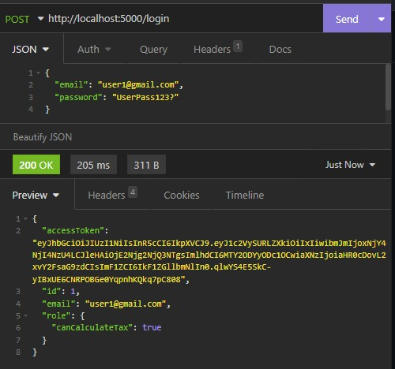
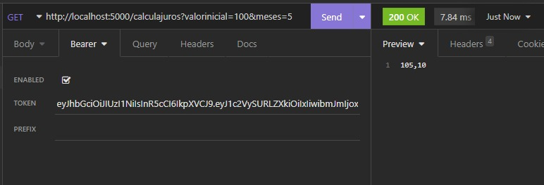
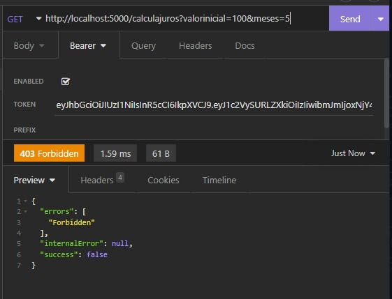

<h1 align="center">Tax Calculator Camerge</h1> 

## **Executando**
Para executar a aplicação é necessário possuir o dotnet instalado em sua máquina.

- É necessário fazer o clone da [API de Taxa](www.google.com)
- Garantir que a porta 5001 do seu localhost está livre
- Acessar a pasta TaxAPI na API de Taxa e executar ```dotnet run``` dentro dela

- Fazer o clone deste repositório
- Garantir que a porta 5000 do seu localhost está livre
- Acessar a pasta ```TaxCalculator.API``` e executar ```dotnet run```

## Features
Esse projeto conta com uma implementação de autenticação utilizando tokens do tipo JWT, além de uma pequena implementação de Autorização por meio de permissões associadas a cada usuário. <br>
Nesta API existem 3 usuários cadastrados, somente 2 deles conseguem executar solicitar o cálculo de juros da API.

Para melhorar a performance da aplicação, uma cache foi implementada para diminuirmos a frequência de acessos à API de taxa, ao remover a necessidade de ficar verificando em toda requisição se o valor foi alterado ou não.

## Login
Para executar os cálculos primeiro é necessário efetuar o login na aplicação, nesse caso segue um exemplo utilizando o Insomnia: <br>

<p align="center">
  
</p>

Então é necessário que você copie o token JWT que foi criado e configurá-lo na requisição do cálculo, e então executar, conforme segue na imagem: <br>

<p align="center">
  
</p>

Note que caso você faça login utilizando o email "user3@gmail.com" você irá ter sucesso ao fazer login, entretanto ao tentar executar os cálculos irá receber um erro 403, Forbidden, significando que esse usuário não possui permissão de executar tal ação, conforme segue na imagem: <br>

<p align="center">
  
</p>


## Documentação
Foi configurado um endpoint para apresentar a documentação da API utilizando o Swagger, para acessá-lo é necessário executar a aplicação com ```dotnet run``` e então acessar o link ```http://localhost:5000/swagger/index.html```.